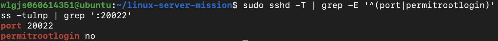
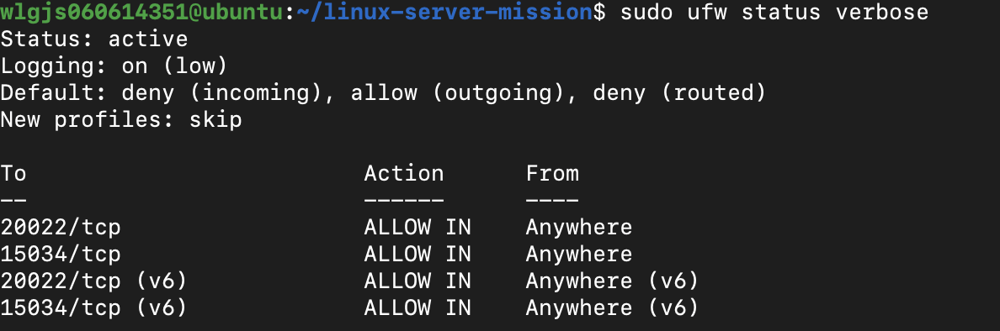
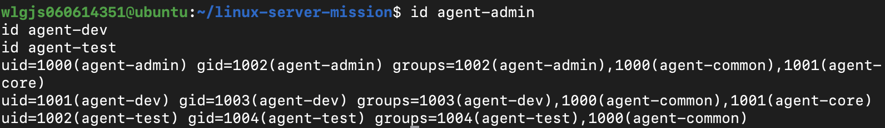
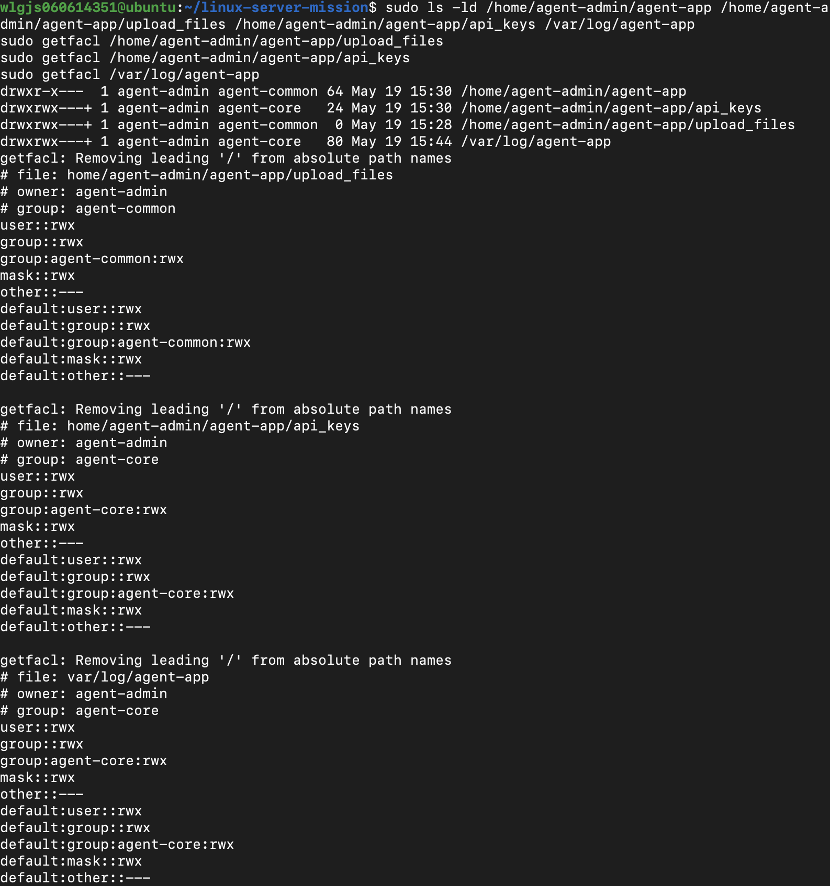
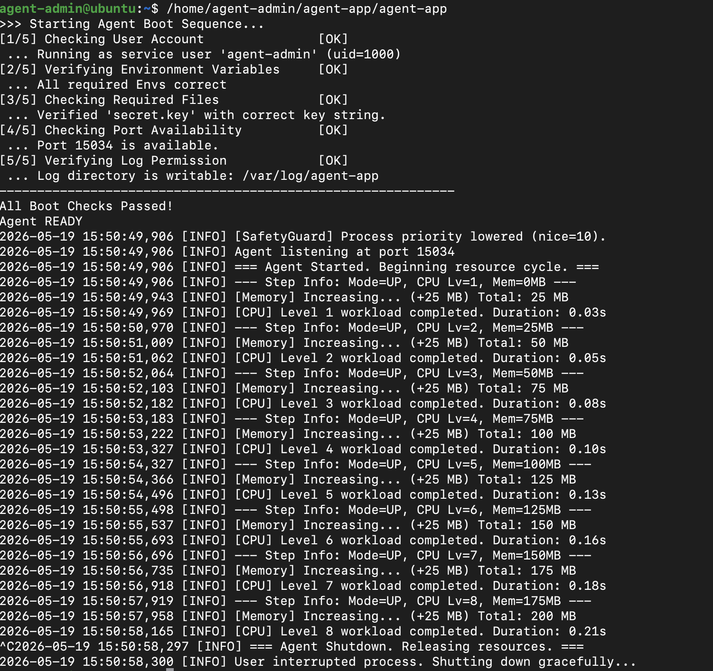
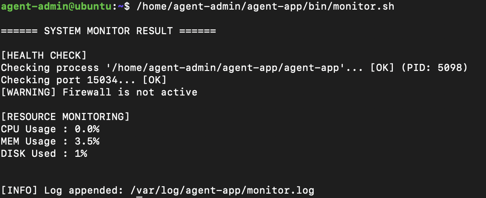
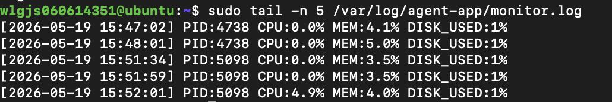
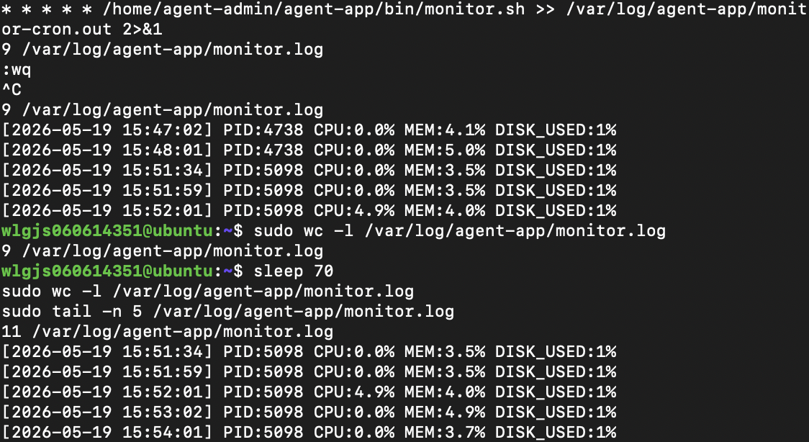

# Linux Server Operation Mission Book

> 이 문서는 서버 운영 미션을 처음부터 끝까지 수행하기 위한 실습형 안내서다.  
> 목표는 단순히 명령어를 따라 치는 것이 아니라, “왜 이 설정이 필요한지” 이해하고, 최종 제출물인 수행 내역서와 자동화 스크립트를 스스로 완성하는 것이다.

---

## 0장. 미션 전체 그림

서버 운영은 “서버가 켜져 있다”에서 끝나지 않는다.  
서버가 어떤 사용자에게 열려 있는지, 어떤 포트로 통신하는지, 어떤 파일을 누가 읽고 쓸 수 있는지, 문제가 생겼을 때 어떤 기록을 남기는지까지 함께 관리해야 한다.

처음에는 이 모든 것이 흩어진 명령어처럼 보인다.  
`useradd`, `chmod`, `ufw`, `cron`, `tail`, `ss` 같은 명령이 각각 따로 있는 것처럼 느껴진다.

하지만 운영자의 눈으로 보면 이 명령어들은 하나의 흐름으로 이어진다.

서버에 들어오는 문을 정한다.  
그 문으로 들어온 사람이 어떤 역할을 가질지 정한다.  
역할에 따라 접근할 수 있는 공간을 나눈다.  
앱이 실행될 환경을 만든다.  
앱과 서버의 상태를 주기적으로 기록한다.  
기록이 너무 커지지 않도록 보존 정책을 만든다.

이 책은 그 흐름을 작은 Linux 서버 하나에서 직접 구성해 보는 기록이다.

### 왜 로그가 중요한가

서버 장애가 발생했을 때 로그가 없다면 원인 분석은 감에 의존하게 된다.  
장애가 발생한 순간 CPU가 높았는지, 메모리가 부족했는지, 디스크가 꽉 찼는지, 앱 프로세스가 죽었는지 알 수 없다.

운영에서 로그는 단순한 기록이 아니다.  
나중에 문제를 설명할 수 있게 해 주는 근거다.

이번 미션의 마지막에 작성할 `monitor.sh`는 그래서 중요하다.  
이 스크립트는 서버의 현재 상태를 사람이 매번 직접 확인하지 않아도, 일정한 형식으로 남겨 주는 작은 운영 도구가 된다.

이번 미션에서는 다음 흐름을 직접 구성한다.

1. SSH 기본 보안 설정
2. 필요한 포트만 허용하는 방화벽 정책
3. 역할 기반 계정, 그룹, 디렉토리 권한 설계
4. 제공 애플리케이션 실행 환경 구성
5. 시스템 상태를 수집하고 로그로 남기는 Bash 자동화
6. cron을 이용한 주기 실행
7. 로그 보존 정책 설계

각 단계는 따로 떨어진 과제가 아니다.  
뒤로 갈수록 앞에서 만든 설정을 사용한다.

예를 들어 `monitor.sh`는 `/var/log/agent-app`에 로그를 써야 한다.  
그러려면 먼저 로그 디렉토리가 있어야 하고, 그 디렉토리에 쓸 수 있는 계정과 그룹 권한이 있어야 한다.  
또 앱이 `15034` 포트에서 실행 중이어야 포트 점검도 의미가 있다.

그래서 이 책은 빠르게 완성본을 만드는 방식이 아니라, 한 단계씩 이유를 확인하면서 진행한다.

### 이 책에서 남길 결과물

마지막에는 두 가지를 남긴다.

- `README.md` 또는 별도 문서 형태의 요구사항 수행 내역서
- `$AGENT_HOME/bin/monitor.sh` 자동화 스크립트

첫 번째 결과물은 “무엇을 했다”가 아니라 “왜 그렇게 했고, 어떻게 확인했는가”를 설명하는 문서다.  
두 번째 결과물은 사람이 하던 점검을 Bash로 자동화한 실행 파일이다.

---

## 1장. 실습 무대 만들기

서버 운영을 배우려면 먼저 작은 서버 한 대가 필요하다.  
이 책에서는 그 서버를 OrbStack 안에 만든 Linux 머신으로 생각한다.

Mac은 우리가 글을 쓰고, 파일을 정리하고, 코드를 작성하는 책상이다.  
OrbStack의 Linux는 그 책상 위에 올려둔 작은 실험실이다.

이 구분이 중요하다. 앞으로 우리는 사용자 계정을 만들고, 그룹을 나누고, 시스템 디렉토리의 권한을 바꾸고, 주기적으로 실행되는 작업을 등록할 것이다. 이런 일은 “내 노트북을 꾸미는 작업”이 아니라 “서버라는 운영 환경을 설계하는 작업”이다.

그래서 이 책의 실습 명령어는 OrbStack의 Linux 터미널에서 실행한다.  
README를 쓰고 수정하는 일은 macOS에서 해도 괜찮지만, 서버를 바꾸는 명령은 Linux 안에서 다룬다.

### 실습 환경 버전

이 문서는 Ubuntu 24.04 LTS 기준으로 진행한다.  
제공된 `linux_agent_app.zip`의 x86_64 실행 파일이 내부 Python 런타임 실행 시 `GLIBC_2.38` 이상을 요구할 수 있기 때문이다.

Ubuntu 22.04 LTS는 보통 glibc 2.35를 사용하므로 앱 실행 단계에서 다음 오류가 발생할 수 있다.

```text
version `GLIBC_2.38' not found
```

이 문제는 계정, sudo, 파일 권한 문제가 아니라 OS 런타임 버전 문제다.  
따라서 기존 Ubuntu 22.04 환경을 억지로 고치기보다 Ubuntu 24.04 LTS 머신을 새로 만들어 진행한다.

OrbStack에서 새 Ubuntu 24.04 머신을 만들려면 macOS 터미널에서 다음을 실행한다.

```bash
orb create ubuntu:24.04 ubuntu24
orb -m ubuntu24
```

`ubuntu24`는 새 머신 이름이다. 기존 `ubuntu` 머신을 바로 삭제하지 않고 새 이름으로 만들면, 이전 작업 기록을 보존한 채 다시 재현할 수 있다.

새 머신 안에 들어간 뒤 버전을 확인한다.

```bash
cat /etc/os-release
ldd --version | head -n 1
uname -m
```

기대하는 기준은 Ubuntu `24.04`와 glibc `2.39` 또는 최소 `2.38` 이상이다.  
이 확인이 끝난 뒤 제공 파일 복사부터 다시 진행한다.

### OrbStack을 선택한 이유

OrbStack은 Mac에서 Linux를 가볍게 띄워 주는 도구다.  
무거운 가상머신을 매번 켜지 않아도 Linux 명령어, 계정, 권한, 디렉토리 구조, Bash 스크립트, cron 같은 주제를 충분히 연습할 수 있다.

이 미션에서 우리가 가장 많이 다룰 내용도 바로 그 영역이다.

- 계정과 그룹을 만들고 역할을 나눈다.
- 디렉토리마다 접근 권한을 다르게 준다.
- 제공된 Linux 애플리케이션을 실행한다.
- Bash로 상태 점검 스크립트를 작성한다.
- cron으로 스크립트를 주기적으로 실행한다.
- 로그를 남기고, 오래된 로그를 관리한다.

다만 OrbStack은 일반적인 클라우드 서버나 Ubuntu VM과 완전히 같지는 않다.  
특히 SSH 서버 운영, 방화벽 정책, `systemctl`로 서비스를 제어하는 부분은 환경에 따라 다르게 보일 수 있다.

이 차이는 실패가 아니다. 오히려 좋은 학습 지점이다.  
운영자는 명령어 하나를 외우는 사람이 아니라, “내가 지금 어떤 환경 위에 있는가”를 먼저 읽는 사람이어야 하기 때문이다.

### 첫 번째 확인: 나는 누구이고 어디에 있는가

OrbStack의 Linux 터미널을 열었다면, 가장 먼저 지금 내가 누구인지 확인한다.

```bash
whoami
id
pwd
```

`whoami`는 현재 사용자 이름을 보여준다.  
`id`는 사용자가 속한 그룹과 권한 정보를 보여준다.  
`pwd`는 지금 서 있는 디렉토리를 보여준다.

이 세 명령은 짧지만 운영 작업의 출발점이다.

| 명령어 | 뜻 | 왜 확인하는가 |
|---|---|---|
| `whoami` | 현재 사용자 이름 출력 | 지금 명령을 실행하는 주체를 확인한다 |
| `id` | UID, GID, 그룹 정보 출력 | 이 사용자가 어떤 권한 범위에 있는지 확인한다 |
| `pwd` | 현재 디렉토리 출력 | 파일을 만들거나 복사할 위치를 착각하지 않기 위해 확인한다 |

운영 작업은 늘 이 세 가지 감각에서 시작한다.

나는 누구인가.  
나는 어떤 권한을 가지고 있는가.  
나는 지금 어디에 서 있는가.

이 질문을 생략하면 뒤에서 만나는 오류가 갑자기 튀어나온 것처럼 느껴진다.  
반대로 이 세 가지를 먼저 확인하면 `Permission denied`, `No such file or directory`, `command not found` 같은 오류도 원인을 좁혀 갈 수 있다.

### 제공 파일 살펴보기

이번 미션에서 실행할 애플리케이션은 `linux_agent_app.zip`으로 제공된다.  
압축 파일 안에는 x86_64 Linux용 `agent-app` 파일과 ARM Linux용 `agent-app-linux-arm64` 파일이 들어 있다.

여기서 한 가지를 먼저 구분해야 한다.  
`linux_agent_app.zip`은 처음에는 Mac의 프로젝트 폴더 안에 있다. OrbStack의 Linux 터미널을 열었다고 해서 그 파일이 자동으로 현재 디렉토리에 놓여 있는 것은 아니다.

먼저 Linux에서 Mac 파일 시스템이 보이는지 확인한다.

```bash
ls -l /mnt/mac/Users
```

명령어를 나누어 보면 다음과 같다.

| 부분 | 의미 |
|---|---|
| `ls` | 파일과 디렉토리 목록을 보여준다 |
| `-l` | 권한, 소유자, 크기, 수정 시간까지 자세히 보여준다 |
| `/mnt/mac/Users` | OrbStack Linux에서 바라본 Mac 사용자 디렉토리 위치다 |

OrbStack에서는 Mac의 파일을 `/mnt/mac/Users/...` 아래에서 볼 수 있다.  
예를 들어 이 프로젝트가 Mac의 Desktop 아래에 있다면 대략 다음과 같은 경로가 된다.

```bash
ls -l /mnt/mac/Users/<Mac 사용자명>/Desktop/Developing-System-Control-Automation-Scripts/linux_agent_app.zip
```

파일이 보이면 Linux 실습용 작업 디렉토리를 하나 만들고, 그곳으로 복사한다.

```bash
mkdir -p ~/linux-server-mission
cp /mnt/mac/Users/<Mac 사용자명>/Desktop/Developing-System-Control-Automation-Scripts/linux_agent_app.zip ~/linux-server-mission/
cd ~/linux-server-mission
```

여기서 하는 일은 세 가지다.

| 명령어 | 뜻 | 왜 필요한가 |
|---|---|---|
| `mkdir -p ~/linux-server-mission` | 실습용 디렉토리를 만든다 | 앞으로의 작업 파일을 한곳에 모으기 위해서다 |
| `cp ... ~/linux-server-mission/` | Mac 쪽 zip 파일을 Linux 작업 공간으로 복사한다 | Linux 안에서 압축 해제와 실행 준비를 하기 위해서다 |
| `cd ~/linux-server-mission` | 작업 디렉토리로 이동한다 | 이후 명령이 같은 위치를 기준으로 실행되게 하기 위해서다 |

`~`는 현재 사용자의 홈 디렉토리를 뜻한다.  
`-p`는 중간 디렉토리가 없으면 함께 만들고, 이미 디렉토리가 있어도 오류로 멈추지 않게 한다.

복사가 끝났다면 Linux 현재 디렉토리에서 파일이 보이는지 확인한다.

```bash
ls -l linux_agent_app.zip
```

압축 파일을 살펴보려면 `unzip` 명령이 필요하다.  
먼저 명령이 있는지 확인한다.

```bash
command -v unzip
```

`command -v`는 특정 명령어가 시스템 어디에 있는지 찾아본다.  
경로가 출력되면 사용할 수 있다는 뜻이고, 아무것도 출력되지 않으면 아직 설치되어 있지 않다는 뜻이다.

아무것도 출력되지 않으면 `unzip` 패키지를 설치한다.

```bash
sudo apt update
sudo apt install -y unzip
```

이 두 줄도 의미가 다르다.

| 명령어 | 뜻 |
|---|---|
| `sudo apt update` | 설치 가능한 패키지 목록을 최신 상태로 가져온다 |
| `sudo apt install -y unzip` | `unzip` 패키지를 설치한다. `-y`는 질문에 자동으로 yes라고 답하게 한다 |

`sudo`는 관리자 권한으로 실행한다는 뜻이다.  
패키지 설치처럼 시스템 전체에 영향을 주는 작업은 일반 사용자 권한만으로는 할 수 없기 때문에 `sudo`가 필요하다.

이제 압축 파일 안에 무엇이 들어 있는지 확인한다.

```bash
unzip -l linux_agent_app.zip
```

여기서 `-l`은 압축을 풀지 않고 목록만 보겠다는 뜻이다.  
아직 실행 파일을 꺼내지 않는 이유는, 먼저 제공 파일의 구조를 확인하는 습관을 들이기 위해서다.

기대하는 구조는 단순하다.

```text
linux_agent_app.zip
├── agent-app                  # x86_64 Linux용 실행 파일
├── agent-app-linux-arm64      # ARM Linux용 실행 파일
└── __MACOSX/._...             # macOS 메타데이터, 실행 대상 아님
```

`__MACOSX`로 시작하는 항목은 macOS가 zip 파일에 함께 넣은 메타데이터다.  
실습에서는 무시하고, 서버 CPU 아키텍처에 맞는 실행 파일만 사용한다.

아직 앱을 실행하지는 않는다.  
먼저 앱이 놓일 자리, 앱을 실행할 사용자, 앱이 읽고 쓸 디렉토리의 권한을 차례로 만들어 갈 것이다.

### 이 책에서 사용할 기준값

앞으로의 장에서는 다음 값을 기준으로 실습을 진행한다.

```text
SSH 포트: 20022
앱 포트: 15034
앱 홈 디렉토리: /home/agent-admin/agent-app
로그 디렉토리: /var/log/agent-app
```

숫자와 경로를 정해 두는 이유는 단순하다.  
서버 운영에서는 “어디에 무엇이 있는지”가 약속되어 있어야 한다.  
약속된 경로가 있어야 스크립트가 단순해지고, 로그를 찾기 쉬워지고, 장애가 났을 때 같은 위치에서 같은 방식으로 확인할 수 있다.

---

## 2장. 운영자가 먼저 정하는 것

서버를 운영한다는 것은 기준을 정하는 일이다.  
기준이 없으면 명령어는 늘 즉흥적으로 실행되고, 나중에 왜 그렇게 했는지 설명하기 어려워진다.

이번 미션에서 먼저 정해야 할 기준은 네 가지다.

### 접속 기준

서버에는 관리자가 들어오는 통로가 필요하다.  
Linux 서버에서 가장 흔한 원격 접속 통로는 SSH다.

기본 SSH 포트는 `22`다.  
하지만 이번 미션에서는 `20022`를 사용한다.

포트를 바꾼다고 보안이 완성되는 것은 아니다.  
다만 자동으로 기본 포트만 훑는 단순한 공격이나 불필요한 접속 시도를 줄이는 데 도움이 된다.

또 하나 중요한 기준은 root 직접 접속을 막는 것이다.  
root는 시스템에서 가장 강한 권한을 가진 계정이다. 이 계정이 바로 외부 접속 대상이 되면 위험이 커진다.

그래서 SSH 장에서는 두 가지를 설정한다.

```text
Port 20022
PermitRootLogin no
```

### 네트워크 기준

서버는 필요한 포트만 열어 두는 것이 좋다.  
열려 있는 포트는 외부와 대화할 수 있는 입구다. 입구가 많을수록 관리해야 할 표면도 넓어진다.

이번 미션에서 외부에 열어 둘 포트는 두 개다.

```text
20022/tcp  SSH 접속
15034/tcp  agent-app 서비스
```

방화벽 장에서는 이 두 포트만 허용하고 나머지 인바운드 연결은 막는 흐름을 연습한다.

### 권한 기준

모든 사용자가 모든 파일을 볼 수 있으면 운영 환경은 금방 위험해진다.  
그래서 계정을 역할별로 나누고, 역할에 따라 접근할 수 있는 디렉토리를 다르게 만든다.

이번 미션에서는 세 계정을 사용한다.

```text
agent-admin  운영 관리자
agent-dev    개발 및 운영 보조
agent-test   테스트 담당자
```

그리고 두 그룹을 사용한다.

```text
agent-common  공통 작업 영역 접근
agent-core    민감한 운영 영역 접근
```

핵심은 `agent-test`가 공유 업로드 디렉토리는 사용할 수 있지만, API 키와 운영 로그에는 접근하지 못하게 하는 것이다.

### 기록 기준

마지막 기준은 로그다.  
운영자는 서버 상태를 기억에 의존하지 않는다. 기록으로 남긴다.

이번 미션에서 `monitor.sh`는 다음 상태를 기록한다.

- 앱 프로세스가 살아 있는가
- 앱 포트가 열려 있는가
- 방화벽이 활성화되어 있는가
- CPU, 메모리, 디스크 사용률이 어느 정도인가

나중에 `cron`을 사용하면 이 점검을 매분 자동으로 실행할 수 있다.

이제 기준을 정했으니, 다음 장부터는 하나씩 실제 Linux 설정으로 옮긴다.

---

## 3장. SSH 기본 보안 설정

SSH는 서버에 원격으로 접속하기 위한 통로다.  
운영자는 이 통로가 열려 있는지, 어느 포트로 열려 있는지, root가 직접 들어올 수 있는지를 확인해야 한다.

그런데 OrbStack의 Linux 머신에서는 처음부터 SSH 서버가 설치되어 있지 않을 수 있다.  
이때 다음 명령을 실행하면 오류가 난다.

```bash
sudo cp /etc/ssh/sshd_config /etc/ssh/sshd_config.bak
```

오류 메시지는 보통 이렇게 생겼다.

```text
cp: cannot stat '/etc/ssh/sshd_config': No such file or directory
```

이 말은 `cp` 명령이 실패했다는 뜻이지만, 더 정확히는 “백업할 원본 파일이 아직 없다”는 뜻이다.  
`/etc/ssh/sshd_config`는 SSH 클라이언트 설정 파일이 아니라 SSH 서버 데몬, 즉 `sshd`의 설정 파일이다. SSH 서버가 설치되어 있지 않으면 이 파일도 없을 수 있다.

### 3.1 SSH 서버가 있는지 확인하기

먼저 `/etc/ssh` 디렉토리에 무엇이 있는지 본다.

```bash
ls -l /etc/ssh
```

`/etc`는 시스템 설정 파일들이 모이는 디렉토리다.  
그 안의 `/etc/ssh`는 SSH와 관련된 설정이 놓이는 자리다.

```text
ls      목록을 본다
-l      자세히 본다
/etc/ssh 확인할 대상 경로
```

그다음 `sshd` 명령이 존재하는지 확인한다.

```bash
command -v sshd
```

`sshd`는 SSH server daemon의 줄임말이다.  
여기서 daemon은 백그라운드에서 계속 실행되며 요청을 기다리는 프로그램을 뜻한다.

아무것도 출력되지 않으면 SSH 서버가 아직 준비되지 않은 상태다.

### 3.2 SSH 서버 설치하기

Ubuntu 계열 OrbStack 머신이라면 다음 패키지를 설치한다.

```bash
sudo apt update
sudo apt install -y openssh-server
```

`apt`는 Ubuntu 계열 Linux에서 패키지를 설치하고 관리하는 도구다.  
`openssh-server`는 SSH 접속을 받아 주는 서버 프로그램이다.

| 명령어 | 의미 |
|---|---|
| `sudo apt update` | 설치 가능한 패키지 목록을 최신 상태로 갱신한다 |
| `sudo apt install -y openssh-server` | SSH 서버 패키지를 설치한다 |
| `-y` | 설치 중 물어보는 질문에 자동으로 yes라고 답한다 |

설치 후 다시 확인한다.

```bash
ls -l /etc/ssh/sshd_config
command -v sshd
```

이제 `/etc/ssh/sshd_config` 파일이 보이면 다음 단계로 넘어갈 수 있다.

### 3.3 SSH 설정 파일 백업

운영 설정 파일을 수정하기 전에는 원본을 남겨 둔다.  
백업은 “되돌아갈 자리”를 만드는 일이다.

```bash
sudo cp /etc/ssh/sshd_config /etc/ssh/sshd_config.bak
```

`cp`는 copy의 줄임말이다.  
이 명령은 원본 설정 파일을 같은 위치에 `.bak`이라는 이름으로 하나 더 만들어 둔다.

```text
sudo      시스템 설정 파일을 읽고 쓸 수 있도록 관리자 권한으로 실행
cp        파일 복사
원본      /etc/ssh/sshd_config
복사본    /etc/ssh/sshd_config.bak
```

백업이 만들어졌는지 확인한다.

```bash
ls -l /etc/ssh/sshd_config*
```

마지막의 `*`는 와일드카드다.  
`sshd_config`로 시작하는 파일을 함께 보여 달라는 뜻이다.

### 3.4 SSH 포트와 Root 로그인 설정

`/etc/ssh/sshd_config` 파일을 연다.

```bash
sudo vi /etc/ssh/sshd_config
```

`vi`는 터미널에서 사용하는 텍스트 편집기다.  
`sudo`를 붙이는 이유는 `/etc/ssh/sshd_config`가 일반 사용자의 개인 파일이 아니라 시스템 설정 파일이기 때문이다.

다음 설정을 추가하거나 수정한다.

```text
Port 20022
PermitRootLogin no
```

`Port 20022`는 SSH가 기본 포트 `22` 대신 `20022`에서 접속을 받게 한다.  
`PermitRootLogin no`는 root 계정이 SSH로 직접 로그인하지 못하게 한다.

### 3.5 SSH 설정 문법 검사

설정 파일을 저장했다면 바로 재시작하지 않고 문법부터 검사한다.

```bash
sudo sshd -t
```

`-t`는 test mode다.  
SSH 서버를 실제로 재시작하지 않고 설정 파일의 문법만 검사한다.

아무 출력이 없으면 설정 문법이 정상이다.

### 3.6 SSH 서비스 재시작

일반 Ubuntu 서버에서는 보통 다음 명령을 사용한다.

```bash
sudo systemctl restart ssh
```

`systemctl`은 systemd가 관리하는 서비스를 제어하는 명령이다.  
`restart ssh`는 SSH 서비스를 다시 시작하라는 뜻이다.

다만 OrbStack 환경에서는 `systemctl`이 기대한 방식으로 동작하지 않을 수 있다.  
그 경우 이 장에서는 설정 파일을 만들고 문법을 확인하는 것까지를 학습 목표로 삼고, 실제 서비스 재시작과 외부 접속 검증은 환경 차이로 기록한다.

### 3.7 확인 명령

```bash
sudo sshd -T | grep -E '^(port|permitrootlogin)'
ss -tulnp | grep ':20022'
```

첫 번째 줄은 SSH 서버가 최종적으로 어떤 설정을 읽고 있는지 확인한다.

| 부분 | 의미 |
|---|---|
| `sshd -T` | SSH 서버의 최종 설정값을 출력한다 |
| `|` | 앞 명령의 출력을 뒤 명령의 입력으로 넘긴다 |
| `grep -E` | 확장 정규식으로 원하는 줄만 고른다 |
| `^(port\|permitrootlogin)` | `port` 또는 `permitrootlogin`으로 시작하는 줄을 찾는다 |

두 번째 줄은 실제로 포트가 열려 있는지 확인한다.

| 부분 | 의미 |
|---|---|
| `ss` | 소켓과 네트워크 연결 상태를 보여준다 |
| `-t` | TCP 연결을 본다 |
| `-u` | UDP 연결을 본다 |
| `-l` | LISTEN 상태, 즉 대기 중인 포트를 본다 |
| `-n` | 포트와 주소를 숫자로 보여준다 |
| `-p` | 어떤 프로세스가 사용하는지 보여준다 |
| `grep ':20022'` | 결과 중 `20022` 포트가 포함된 줄만 고른다 |

기대 결과:

```text
port 20022
permitrootlogin no
```

만약 `ss -tulnp | grep ':20022'`에서 아무것도 나오지 않는다면, 설정은 존재하지만 SSH 서버 프로세스가 실제로 실행 중이 아닐 수 있다.  
OrbStack에서는 이 차이를 구분해서 기록하는 것이 더 중요하다.

---

## 4장. 방화벽 설정

이 문서는 Ubuntu 기본 환경을 기준으로 UFW를 사용한다.  
방화벽 정책은 “필요한 포트만 허용”하는 것이 핵심이다.

방화벽은 서버 앞에 세우는 문지기와 비슷하다.  
앱이 실행 중이어도 방화벽이 막고 있으면 외부에서 접근할 수 없고, 앱이 필요하지 않은 포트가 열려 있으면 불필요한 위험이 늘어난다.

### 4.1 UFW 설치 확인

```bash
sudo apt update
sudo apt install -y ufw
```

`ufw`는 uncomplicated firewall의 줄임말이다.  
복잡한 방화벽 규칙을 비교적 간단한 명령으로 다룰 수 있게 해 주는 Ubuntu 계열 도구다.

### 4.2 기본 정책 설정

```bash
sudo ufw default deny incoming
sudo ufw default allow outgoing
```

기본 정책은 “규칙에 없으면 어떻게 할 것인가”를 정한다.

| 명령어 | 의미 |
|---|---|
| `default deny incoming` | 들어오는 연결은 기본적으로 거부한다 |
| `default allow outgoing` | 서버에서 밖으로 나가는 연결은 기본적으로 허용한다 |

운영 서버에서는 보통 외부에서 들어오는 입구를 최소화한다.  
그래서 먼저 모두 막고, 필요한 포트만 하나씩 열어 주는 방식으로 접근한다.

### 4.3 필요한 포트만 허용

```bash
sudo ufw allow 20022/tcp
sudo ufw allow 15034/tcp
```

`allow`는 해당 포트로 들어오는 연결을 허용한다는 뜻이다.  
`/tcp`는 TCP 프로토콜을 의미한다.

```text
20022/tcp  SSH 접속용
15034/tcp  agent-app 서비스용
```

### 4.4 UFW 활성화

```bash
sudo ufw enable
```

설정한 방화벽 규칙은 `enable`을 해야 실제로 활성화된다.  
OrbStack에서는 네트워크 구조상 UFW 동작이 일반 VM과 다르게 보일 수 있지만, 방화벽 정책을 어떻게 선언하는지는 같은 방식으로 익힐 수 있다.

### 4.5 확인 명령

```bash
sudo ufw status verbose
```

`status`는 현재 방화벽 상태를 보여 주고, `verbose`는 기본 정책까지 자세히 보여 준다.

기대 결과에는 다음 항목이 포함되어야 한다.

```text
Status: active
20022/tcp ALLOW IN Anywhere
15034/tcp ALLOW IN Anywhere
```

---

## 5장. 계정, 그룹, 권한 설계

### 5.1 계정과 그룹의 의미

이번 미션에서는 역할을 다음처럼 나눈다.

| 계정 | 역할 |
|---|---|
| `agent-admin` | 운영/관리, cron 실행 |
| `agent-dev` | 개발/운영, `monitor.sh` 작성 |
| `agent-test` | QA/테스트 |

| 그룹 | 포함 계정 | 목적 |
|---|---|---|
| `agent-common` | admin, dev, test | 공유 업로드 디렉토리 접근 |
| `agent-core` | admin, dev | API 키와 로그 접근 |

핵심은 `agent-test`가 공유 파일에는 접근할 수 있지만, API 키와 운영 로그에는 접근하지 못하게 하는 것이다.

### 5.2 그룹 생성

```bash
sudo groupadd agent-common
sudo groupadd agent-core
```

`groupadd`는 새 그룹을 만든다.  
그룹은 여러 사용자를 하나의 권한 단위로 묶기 위한 이름표다.

이미 존재한다면 오류가 날 수 있다. 이 경우 `getent group`으로 확인한다.

```bash
getent group agent-common
getent group agent-core
```

`getent`는 시스템 데이터베이스에서 정보를 조회하는 명령이다.  
여기서는 `group` 데이터베이스에서 해당 그룹이 존재하는지 확인한다.

### 5.3 계정 생성

```bash
sudo useradd -m -s /bin/bash agent-admin
sudo useradd -m -s /bin/bash agent-dev
sudo useradd -m -s /bin/bash agent-test
```

`useradd`는 새 사용자를 만든다.

| 옵션 | 의미 |
|---|---|
| `-m` | 사용자의 홈 디렉토리를 함께 만든다 |
| `-s /bin/bash` | 로그인 셸을 Bash로 지정한다 |

필요하면 비밀번호를 설정한다.

```bash
sudo passwd agent-admin
sudo passwd agent-dev
sudo passwd agent-test
```

`passwd`는 사용자 비밀번호를 설정하거나 변경한다.  
이번 실습에서 계정 전환만 필요하다면 환경에 따라 비밀번호 설정 없이 `sudo -u` 또는 `sudo -iu`로 진행할 수도 있다.

### 5.4 그룹에 계정 추가

```bash
sudo usermod -aG agent-common,agent-core agent-admin
sudo usermod -aG agent-common,agent-core agent-dev
sudo usermod -aG agent-common agent-test
```

`usermod`는 기존 사용자 정보를 수정한다.

| 옵션 | 의미 |
|---|---|
| `-G` | 사용자가 속할 보조 그룹 목록을 지정한다 |
| `-a` | 기존 그룹을 유지한 채 새 그룹을 추가한다 |

`-a` 없이 `-G`만 사용하면 기존 보조 그룹이 덮어써질 수 있다.  
그래서 그룹을 추가할 때는 보통 `-aG`를 함께 쓴다.

### 5.5 확인 명령

```bash
id agent-admin
id agent-dev
id agent-test
```

`id 사용자명`은 해당 사용자의 UID, 기본 그룹, 보조 그룹을 보여 준다.  
계정과 그룹을 만든 뒤에는 반드시 `id`로 실제 반영 여부를 확인한다.

기대 관계:

- `agent-admin`: `agent-common`, `agent-core`
- `agent-dev`: `agent-common`, `agent-core`
- `agent-test`: `agent-common`

---

## 6장. 디렉토리 구조와 권한

### 6.1 환경 변수 기준 경로

이번 문서에서는 다음 경로를 기준으로 한다.

```bash
export AGENT_HOME=/home/agent-admin/agent-app
```

`export`는 현재 셸과 그 셸에서 실행되는 프로그램들이 변수를 사용할 수 있게 내보내는 명령이다.  
`AGENT_HOME`은 앱과 스크립트가 기준으로 삼을 홈 디렉토리다.

### 6.2 ACL 도구 준비

이 장에서는 기본 권한인 `chmod`만 쓰지 않고 ACL도 함께 사용한다.  
ACL은 파일과 디렉토리에 더 세밀한 권한 규칙을 붙일 수 있게 해 주는 기능이다.

먼저 `setfacl`과 `getfacl` 명령이 있는지 확인한다.

```bash
command -v setfacl
command -v getfacl
```

아무것도 출력되지 않거나 명령을 찾을 수 없다고 나오면 `acl` 패키지를 설치한다.

```bash
sudo apt update
sudo apt install -y acl
```

설치 후 다시 확인한다.

```bash
command -v setfacl
command -v getfacl
```

### 6.3 디렉토리 생성

```bash
sudo mkdir -p /home/agent-admin/agent-app/upload_files
sudo mkdir -p /home/agent-admin/agent-app/api_keys
sudo mkdir -p /home/agent-admin/agent-app/bin
sudo mkdir -p /var/log/agent-app
```

`mkdir`은 디렉토리를 만든다.  
`-p`는 부모 디렉토리가 없으면 함께 만들고, 이미 존재해도 오류로 멈추지 않게 한다.

각 디렉토리의 역할은 다음과 같다.

| 경로 | 역할 |
|---|---|
| `/home/agent-admin/agent-app` | 앱의 기준 디렉토리 |
| `upload_files` | 공통 업로드 파일 영역 |
| `api_keys` | API 키처럼 민감한 파일을 두는 영역 |
| `bin` | 실행 스크립트를 두는 영역 |
| `/var/log/agent-app` | 앱과 모니터링 로그를 남기는 영역 |

### 6.4 소유자와 그룹 설정

Linux 파일 권한은 먼저 “누가 이 파일의 주인인가”에서 출발한다.  
여기서 주인은 두 층으로 나뉜다.

| 구분 | 의미 |
|---|---|
| 소유자 user | 파일을 대표로 소유하는 한 명의 사용자 |
| 소유 그룹 group | 파일에 함께 접근할 수 있는 하나의 그룹 |
| 기타 사용자 others | 소유자도 아니고 소유 그룹에도 속하지 않는 나머지 사용자 |

`chown`은 이 중 소유자와 소유 그룹을 바꾸는 명령이다.  
이 미션에서 `chown`이 중요한 이유는 단순히 파일 주인을 예쁘게 정리하기 위해서가 아니라, 역할 기반 접근 정책을 실제 파일 시스템에 반영하기 위해서다.

```bash
sudo chown -R agent-admin:agent-common /home/agent-admin/agent-app
sudo chown agent-admin:agent-common /home/agent-admin/agent-app/upload_files
sudo chown agent-admin:agent-core /home/agent-admin/agent-app/api_keys
sudo chown agent-admin:agent-core /var/log/agent-app
```

`chown`은 파일이나 디렉토리의 소유자와 소유 그룹을 바꾼다.

```text
chown 사용자:그룹 경로
```

예를 들어 다음 명령은 `/var/log/agent-app`의 소유자를 `agent-admin`으로, 소유 그룹을 `agent-core`로 바꾼다.

```bash
sudo chown agent-admin:agent-core /var/log/agent-app
```

이렇게 설정하면 “운영 계정인 `agent-admin`이 관리하고, 핵심 운영 그룹인 `agent-core`가 함께 접근한다”는 의미가 파일 시스템에 남는다.

`-R`은 recursive의 의미로, 지정한 디렉토리 아래까지 재귀적으로 적용한다.  
즉 `sudo chown -R agent-admin:agent-common /home/agent-admin/agent-app`은 앱 홈 디렉토리와 그 안의 기존 파일, 하위 디렉토리까지 한 번에 소유자와 그룹을 맞춘다.  
다만 `-R`은 범위가 넓은 옵션이므로 항상 경로를 정확히 확인한 뒤 사용해야 한다. 실수로 `/home`이나 `/` 같은 큰 경로에 적용하면 많은 파일의 소유권이 바뀌어 시스템이 망가질 수 있다.

민감한 영역인 `api_keys`와 로그 디렉토리는 `agent-core` 그룹에 묶어 `agent-test`가 접근하지 못하게 한다.

정리하면 이 장의 `chown` 정책은 다음과 같다.

| 경로 | 소유자 | 소유 그룹 | 이유 |
|---|---|---|---|
| `/home/agent-admin/agent-app` | `agent-admin` | `agent-common` | 앱 홈은 운영 계정이 관리하고 공통 그룹이 최소 접근할 수 있게 한다 |
| `upload_files` | `agent-admin` | `agent-common` | admin, dev, test가 함께 쓰는 공유 업로드 영역이다 |
| `api_keys` | `agent-admin` | `agent-core` | admin, dev만 접근해야 하는 민감 정보 영역이다 |
| `/var/log/agent-app` | `agent-admin` | `agent-core` | 운영 로그는 admin, dev만 읽고 쓸 수 있어야 한다 |

여기서 자주 헷갈리는 점은 `chown`과 `chmod`의 역할 차이다.  
`chown`은 “누구에게 권한 판단을 적용할 것인가”를 정하고, `chmod`는 “그 대상에게 어떤 행동을 허용할 것인가”를 정한다.

```text
chown = 소유자/그룹을 정한다
chmod = 읽기/쓰기/실행 권한을 정한다
```

따라서 `chown agent-admin:agent-core ...`만 실행했다고 해서 자동으로 `agent-core`가 읽고 쓸 수 있는 것은 아니다.  
그 다음 `chmod 770 ...`처럼 그룹에 읽기, 쓰기, 실행 권한을 부여해야 실제 접근이 가능해진다.

### 6.5 기본 권한 설정

```bash
sudo chmod 750 /home/agent-admin/agent-app
sudo chmod 770 /home/agent-admin/agent-app/upload_files
sudo chmod 770 /home/agent-admin/agent-app/api_keys
sudo chmod 770 /var/log/agent-app
```

`chmod`는 권한 숫자를 바꾼다.  
숫자는 소유자, 그룹, 기타 사용자 순서로 읽는다.

| 숫자 | 권한 |
|---|---|
| `7` | 읽기, 쓰기, 실행 모두 가능 |
| `6` | 읽기와 쓰기 가능, 실행 불가 |
| `5` | 읽기와 실행 가능, 쓰기는 불가 |
| `0` | 접근 불가 |

따라서 `750`은 소유자는 모두 가능, 그룹은 읽기와 실행 가능, 기타 사용자는 접근 불가라는 뜻이다.  
`770`은 소유자와 그룹은 모두 가능, 기타 사용자는 접근 불가라는 뜻이다.

디렉토리에서 `x` 권한은 파일 실행과 조금 다르게 “디렉토리 안으로 들어갈 수 있는 권한”에 가깝다.  
예를 들어 디렉토리에 읽기 권한만 있고 실행 권한이 없으면 목록을 보거나 내부 파일에 접근하는 과정에서 예상치 못한 `Permission denied`가 날 수 있다.  
그래서 공유 디렉토리에는 보통 읽기, 쓰기, 실행이 함께 필요하다.

이번 미션의 권한 숫자를 문장으로 풀면 다음과 같다.

| 경로 | 권한 | 해석 |
|---|---|---|
| `/home/agent-admin/agent-app` | `750` | 소유자는 관리 가능, 그룹은 들어가서 읽고 실행 가능, 기타 사용자는 차단 |
| `upload_files` | `770` | 소유자와 공통 그룹은 업로드 파일을 읽고 쓸 수 있음 |
| `api_keys` | `770` | 소유자와 핵심 그룹만 키 파일을 읽고 쓸 수 있음 |
| `/var/log/agent-app` | `770` | 소유자와 핵심 그룹만 로그를 기록하고 확인할 수 있음 |

### 6.6 ACL을 이용한 기본 권한 유지

새로 생성되는 파일에도 그룹 권한이 유지되도록 기본 ACL을 설정한다.

```bash
sudo setfacl -m g:agent-common:rwx /home/agent-admin/agent-app/upload_files
sudo setfacl -d -m g:agent-common:rwx /home/agent-admin/agent-app/upload_files

sudo setfacl -m g:agent-core:rwx /home/agent-admin/agent-app/api_keys
sudo setfacl -d -m g:agent-core:rwx /home/agent-admin/agent-app/api_keys

sudo setfacl -m g:agent-core:rwx /var/log/agent-app
sudo setfacl -d -m g:agent-core:rwx /var/log/agent-app
```

`setfacl`은 ACL 규칙을 설정한다.

| 부분 | 의미 |
|---|---|
| `-m` | ACL 규칙을 추가하거나 수정한다 |
| `-d` | 새로 만들어지는 파일과 디렉토리에 적용될 기본 ACL을 설정한다 |
| `g:agent-common:rwx` | `agent-common` 그룹에 읽기, 쓰기, 실행 권한을 준다 |
| `g:agent-core:rwx` | `agent-core` 그룹에 읽기, 쓰기, 실행 권한을 준다 |

일반 `chmod`만 사용하면 새 파일을 만들 때 권한이 기대와 다르게 생길 수 있다.  
기본 ACL을 설정하면 디렉토리 안에 새 파일이 만들어져도 그룹 접근 정책을 유지하기 쉽다.

ACL을 사용하는 이유는 “처음 만든 디렉토리의 권한”과 “나중에 그 안에 생기는 파일의 권한”이 항상 같지는 않기 때문이다.  
사용자의 기본 `umask` 설정에 따라 새 파일이 `644`처럼 만들어지면, 같은 그룹 사용자가 쓰지 못하는 상황이 생길 수 있다. 운영 환경에서는 이런 권한 꼬임이 배포 실패나 로그 기록 실패로 이어진다.

이 미션에서는 `setfacl -d`로 기본 ACL을 걸어 둔다.  
`default:`로 시작하는 ACL 규칙은 지금 존재하는 파일 하나에만 적용되는 것이 아니라, 앞으로 그 디렉토리 안에 만들어질 파일과 디렉토리에 상속될 기본 규칙이다.

확인할 때 `getfacl` 출력에서 다음 흐름을 보면 된다.

```text
group:agent-core:rwx
default:group:agent-core:rwx
```

첫 줄은 현재 디렉토리에 대한 권한이고, `default:` 줄은 앞으로 생성될 항목에 물려줄 권한이다.

### 6.7 확인 명령

현재 사용자가 `agent-admin` 또는 관련 그룹에 속하지 않았다면 `/home/agent-admin/agent-app` 아래를 바로 볼 수 없을 수 있다.  
이것은 설정이 잘못된 것이 아니라, 앞에서 `chmod 750`으로 접근을 제한했기 때문에 생기는 자연스러운 결과다.

운영자가 권한 설정을 확인할 때는 `sudo`로 확인한다.

```bash
sudo ls -ld /home/agent-admin/agent-app
sudo ls -ld /home/agent-admin/agent-app/upload_files
sudo ls -ld /home/agent-admin/agent-app/api_keys
sudo ls -ld /var/log/agent-app

sudo getfacl /home/agent-admin/agent-app/upload_files
sudo getfacl /home/agent-admin/agent-app/api_keys
sudo getfacl /var/log/agent-app
```

`getfacl`은 현재 적용된 ACL 규칙을 읽어 온다.  
`ls -l`이 기본 권한을 빠르게 보여 준다면, `getfacl`은 더 세밀한 권한 규칙까지 보여 준다.

---

## 7장. 애플리케이션 실행 환경 구성

### 7.1 환경 변수 설정

앱은 실행될 때 몇 가지 환경 변수를 검사한다.  
이 값들이 없으면 앱은 자신이 어느 디렉토리를 기준으로 실행되어야 하는지, 어느 포트를 사용해야 하는지, 키 파일과 로그 디렉토리가 어디 있는지 알 수 없다.

먼저 `agent-admin` 계정으로 들어간다.

```bash
sudo -iu agent-admin
```

그 다음 현재 셸에 다음 값을 설정한다.

```bash
export AGENT_HOME=/home/agent-admin/agent-app
export AGENT_PORT=15034
export AGENT_UPLOAD_DIR=$AGENT_HOME/upload_files
export AGENT_KEY_PATH=$AGENT_HOME/api_keys/t_secret.key
export AGENT_LOG_DIR=/var/log/agent-app
```

환경 변수는 앱이 실행될 때 필요한 약속을 셸에 알려 주는 방법이다.

| 변수 | 의미 |
|---|---|
| `AGENT_HOME` | 앱이 설치된 기준 디렉토리 |
| `AGENT_PORT` | 앱이 사용할 포트 |
| `AGENT_UPLOAD_DIR` | 업로드 파일을 저장할 위치 |
| `AGENT_KEY_PATH` | API 키 파일 경로 |
| `AGENT_LOG_DIR` | 로그를 남길 디렉토리 |

`$AGENT_HOME`처럼 앞에 `$`를 붙이면 이미 정의된 변수 값을 가져와서 사용할 수 있다.

설정이 제대로 들어갔는지 확인한다.

```bash
env | grep '^AGENT_'
```

`env`는 현재 셸에 설정된 환경 변수를 보여 준다.  
`grep '^AGENT_'`는 그중 `AGENT_`로 시작하는 값만 골라서 보여 준다.

환경 변수는 현재 셸에만 살아 있다.  
`exit`로 나갔다가 다시 `sudo -iu agent-admin`으로 들어오면 방금 입력한 값이 사라질 수 있다.

매번 입력하지 않으려면 `agent-admin`의 `~/.bashrc`에 저장한다.

```bash
cat <<'EOF' >> ~/.bashrc
export AGENT_HOME=/home/agent-admin/agent-app
export AGENT_PORT=15034
export AGENT_UPLOAD_DIR=$AGENT_HOME/upload_files
export AGENT_KEY_PATH=$AGENT_HOME/api_keys/t_secret.key
export AGENT_LOG_DIR=/var/log/agent-app
EOF
```

저장한 내용을 현재 셸에 즉시 적용하려면 다음을 실행한다.

```bash
source ~/.bashrc
```

`source`는 파일 안의 셸 명령을 현재 셸에 바로 적용한다.  
`~/.bashrc`에 환경 변수를 추가했다면, 새 터미널을 열지 않고도 현재 터미널에 반영할 수 있다.

확인까지 다시 한다.

```bash
env | grep '^AGENT_'
```

### 7.2 키 파일 생성

이 단계는 7.1에서 들어간 `agent-admin` 셸에서 그대로 진행한다.  
`agent-admin`은 운영 계정이지 sudo 관리자 계정이 아닐 수 있으므로, 여기서는 `sudo`를 다시 붙이지 않는다.

```bash
whoami
echo agent_api_key_test > /home/agent-admin/agent-app/api_keys/t_secret.key
chgrp agent-core /home/agent-admin/agent-app/api_keys/t_secret.key
chmod 660 /home/agent-admin/agent-app/api_keys/t_secret.key
```

`whoami` 결과가 `agent-admin`인지 먼저 확인한다.  
그 상태에서 키 파일을 만들면 파일 소유자는 자연스럽게 `agent-admin`이 된다.

| 부분 | 의미 |
|---|---|
| `echo agent_api_key_test` | 문자열을 출력한다 |
| `>` | 출력 내용을 파일에 저장한다. 기존 파일이 있으면 덮어쓴다 |
| `chgrp agent-core` | 파일 그룹을 `agent-core`로 맞춘다 |
| `chmod 660` | 소유자와 그룹만 읽고 쓸 수 있게 한다 |

API 키는 민감한 파일이므로 기타 사용자에게 권한을 주지 않는다.

### 7.3 제공 앱 배치

현재 제공 파일은 `linux_agent_app.zip`이며, 압축을 풀면 CPU 아키텍처별 Linux 실행 파일이 나온다.
1장에서 준비한 `unzip` 명령을 여기서 실제로 사용한다.

먼저 원래 실습 사용자 셸로 돌아간다.

```bash
exit
```

7.1에서 `sudo -iu agent-admin`으로 들어갔다면, `exit`는 `agent-admin` 셸을 닫고 원래 sudo를 사용할 수 있는 실습 사용자로 돌아온다.  
앱 파일 복사와 소유권 변경은 시스템 경로를 다루므로 이 사용자에서 `sudo`로 수행한다.

지금 디렉토리에 `linux_agent_app.zip`이 있는지 확인한다.

```bash
ls -l linux_agent_app.zip
```

파일이 없다면 1장의 “제공 파일 살펴보기”로 돌아가서 Mac 프로젝트 폴더의 `linux_agent_app.zip`을 Linux 작업 디렉토리로 복사한다.

```bash
unzip linux_agent_app.zip
```

여기서는 `-l` 없이 `unzip`을 실행하므로 실제로 압축을 푼다.  
압축이 풀리면 현재 디렉토리에 `agent-app`과 `agent-app-linux-arm64` 실행 파일이 생긴다.

먼저 실습 서버의 CPU 아키텍처를 확인한다.

```bash
uname -m
```

출력에 따라 복사할 파일이 달라진다.

| `uname -m` 출력 | 사용할 파일 |
|---|---|
| `x86_64` | `./agent-app` |
| `aarch64` 또는 `arm64` | `./agent-app-linux-arm64` |

실습 서버의 현재 작업 디렉토리에서 맞는 앱 파일을 `$AGENT_HOME`으로 복사한다.  
대상 파일명은 항상 `/home/agent-admin/agent-app/agent-app`으로 맞춘다. 이렇게 해 두면 뒤에서 실행 명령과 `monitor.sh`가 아키텍처와 상관없이 같은 경로를 사용할 수 있다.

x86_64 Linux라면 다음을 실행한다.

```bash
sudo cp ./agent-app /home/agent-admin/agent-app/agent-app
sudo chown agent-admin:agent-core /home/agent-admin/agent-app/agent-app
sudo chmod 750 /home/agent-admin/agent-app/agent-app
```

ARM Linux라면 다음을 실행한다.

```bash
sudo cp ./agent-app-linux-arm64 /home/agent-admin/agent-app/agent-app
sudo chown agent-admin:agent-core /home/agent-admin/agent-app/agent-app
sudo chmod 750 /home/agent-admin/agent-app/agent-app
```

복사 후에는 파일의 소유자, 그룹, 실행 권한을 운영 기준에 맞춘다.

| 명령 | 이유 |
|---|---|
| `sudo cp ... /home/agent-admin/agent-app/agent-app` | 서버 아키텍처에 맞는 실행 파일을 앱 홈 디렉토리에 공통 이름으로 배치한다 |
| `sudo chown agent-admin:agent-core ...` | 앱 파일을 운영 계정과 핵심 그룹이 관리하게 한다 |
| `sudo chmod 750 ...` | 소유자는 실행 가능, 그룹은 읽기와 실행 가능, 기타 사용자는 접근 불가로 만든다 |

앱 실행 파일의 소유자를 `agent-admin`으로 두는 이유는 앱을 운영 계정이 실행하고 관리하기 때문이다.  
그룹을 `agent-core`로 둔 이유는 운영 핵심 그룹에 속한 `agent-dev`도 파일을 확인하거나 운영 작업에 참여할 수 있게 하기 위해서다.

여기서 `chmod 750`은 다음 의미를 가진다.

```text
agent-admin      rwx  앱 실행과 교체 가능
agent-core       r-x  앱 확인과 실행 가능, 직접 수정은 불가
others           ---  접근 불가
```

운영 파일은 “누구나 실행 가능”하게 두기보다, 실제 운영에 참여하는 계정과 그룹으로 범위를 좁히는 편이 안전하다.

확인 단계에서는 `file` 명령도 사용한다.  
이 명령이 없다면 먼저 설치한다.

```bash
command -v file
```

아무것도 출력되지 않으면 다음처럼 설치한다.

```bash
sudo apt update
sudo apt install -y file
```

확인:

```bash
sudo ls -l /home/agent-admin/agent-app/agent-app
sudo file /home/agent-admin/agent-app/agent-app
```

`file` 명령은 파일의 종류를 판별한다.  
여기서는 `agent-app`이 Linux 실행 파일인지 확인하는 데 사용한다.

만약 `ls: cannot access '/home/agent-admin/agent-app/agent-app': Permission denied`가 나온다면 파일이 없는 것이 아니라 현재 사용자에게 경로 접근 권한이 없다는 뜻일 수 있다.  
이때는 위처럼 `sudo`를 붙여 확인한다.

### 7.4 앱 실행

먼저 원래 sudo 가능한 실습 사용자 셸에서 확인 도구와 런타임 버전을 점검한다.  
`agent-admin` 계정으로 이미 들어가 있다면 `exit`로 나온 뒤 진행한다. 원래 사용자 셸이라면 `exit`를 실행하지 않는다.

```bash
command -v file || sudo apt install -y file
sudo file /home/agent-admin/agent-app/agent-app
uname -m
ldd --version | head -n 1
```

여기서 `agent-app`이라는 이름이 두 번 등장해서 헷갈릴 수 있다.

```text
/home/agent-admin/agent-app        디렉토리
/home/agent-admin/agent-app/agent-app  실행 파일
```

따라서 `file agent-app`을 실행하면 현재 위치에 따라 디렉토리라고 나올 수 있다.  
실행 파일을 확인하려면 전체 경로 또는 디렉토리 안의 파일명을 정확히 지정한다.

`file: command not found`가 나오면 앱 문제가 아니라 `file` 패키지가 아직 설치되지 않은 것이다.  
이때는 위 명령처럼 원래 실습 사용자에서 `sudo apt install -y file`로 설치한다.

이제 루트가 아닌 `agent-admin` 계정으로 앱을 실행한다.

```bash
sudo -iu agent-admin
export AGENT_HOME=/home/agent-admin/agent-app
export AGENT_PORT=15034
export AGENT_UPLOAD_DIR=$AGENT_HOME/upload_files
export AGENT_KEY_PATH=$AGENT_HOME/api_keys/t_secret.key
export AGENT_LOG_DIR=/var/log/agent-app
env | grep '^AGENT_'
```

`sudo -iu agent-admin`은 `agent-admin` 사용자로 로그인한 것처럼 셸을 연다.  
`-i`는 login shell을 의미하고, `-u agent-admin`은 전환할 사용자를 지정한다.

다음 한 줄이 실제 앱 실행 명령이다.

```bash
/home/agent-admin/agent-app/agent-app
```

앱을 root가 아니라 `agent-admin`으로 실행하는 이유는 운영 권한을 제한하기 위해서다.  
앱이 필요 이상의 권한을 가지면, 앱에 문제가 생겼을 때 시스템 전체에 영향을 줄 가능성이 커진다.

성공하면 Boot Sequence가 출력되고 마지막에 `Agent READY`가 나온다.  
이 상태에서는 앱이 전면 실행 중이므로 현재 터미널은 앱이 차지한다. 포트 확인은 다른 터미널에서 하거나, 앱을 실행한 터미널은 그대로 둔 채 새 터미널을 연다.

`linux_agent_app.zip`의 x86_64 실행 파일은 실행 중 내부 Python 런타임을 `/tmp/_MEI...` 아래에 풀어서 사용한다.  
이때 다음과 같은 오류가 나오면 권한 문제가 아니라 OS의 glibc 버전이 실행 파일보다 낮다는 뜻이다.

```text
[PYI-....:ERROR] Failed to load Python shared library '/tmp/_MEI.../libpython3.12.so.1.0':
/lib/x86_64-linux-gnu/libm.so.6: version `GLIBC_2.38' not found
```

Ubuntu 22.04 LTS는 보통 glibc 2.35를 사용하므로 `GLIBC_2.38`을 요구하는 x86_64 빌드와 맞지 않을 수 있다.  
이 경우 `sudo`를 붙이거나 권한을 바꿔도 해결되지 않는다.

해결 방법은 둘 중 하나다.

| 방법 | 설명 |
|---|---|
| Ubuntu 24.04 LTS 환경에서 실행 | glibc 2.38 이상을 제공하므로 제공된 x86_64 실행 파일과 맞는다 |
| Ubuntu 22.04용으로 다시 빌드된 앱 사용 | 과제 환경을 22.04로 고정해야 한다면 22.04에서 빌드된 실행 파일이 필요하다 |

운영체제의 glibc만 수동 업그레이드하는 방식은 권장하지 않는다.  
glibc는 시스템 핵심 라이브러리라 잘못 바꾸면 `sudo`, `apt`, 셸 같은 기본 명령까지 영향을 받을 수 있다.

앱 실행 중 다음 오류가 나오면 환경 변수가 현재 셸에 없는 것이다.

```text
[2/5] Verifying Environment Variables     [FAIL]
>>> Critical Env 'AGENT_HOME' is missing.
```

이때는 앱 문제가 아니라 실행 전에 환경 변수를 다시 설정해야 한다는 뜻이다.

```bash
env | grep '^AGENT_'
```

아무것도 출력되지 않으면 7.1의 `export` 명령을 다시 실행하거나, `~/.bashrc`에 저장한 뒤 `source ~/.bashrc`를 실행한다.

성공 기준:

```text
[1/5] Checking User Account               [OK]
[2/5] Verifying Environment Variables     [OK]
[3/5] Checking Required Files             [OK]
[4/5] Checking Port Availability          [OK]
[5/5] Verifying Log Permission            [OK]
Agent READY
```

### 7.5 포트 확인

다른 터미널에서 확인한다.

```bash
ss -tulnp | grep ':15034'
```

이 명령은 앱이 실제로 `15034` 포트에서 연결을 기다리고 있는지 확인한다.  
앱 실행 메시지만 보고 끝내지 않고, 운영체제 수준에서 포트가 열렸는지 확인하는 과정이다.

기대 결과:

```text
LISTEN ... 0.0.0.0:15034 ...
```

### 7.6 앱 종료

앱을 터미널에서 직접 실행하면 그 터미널은 앱 프로세스가 차지한다.  
이 상태를 전면 실행이라고 생각하면 된다.

가장 단순한 종료 방법은 앱이 실행 중인 터미널에서 `Ctrl+C`를 누르는 것이다.

```text
Ctrl+C
```

`Ctrl+C`는 현재 터미널에서 실행 중인 프로세스에 인터럽트 신호를 보낸다.  
대부분의 전면 실행 프로그램은 이 신호를 받으면 종료된다.

다른 터미널에서 종료해야 한다면 먼저 프로세스를 찾는다.

```bash
pgrep -af 'agent-app'
```

`pgrep`은 실행 중인 프로세스를 찾는 명령이다.  
`-a`는 PID와 함께 실행 명령 전체를 보여 주고, `-f`는 프로세스 이름뿐 아니라 전체 명령줄에서 패턴을 찾게 한다.

출력 예시는 다음과 비슷하다.

```text
48291 /home/agent-admin/agent-app/agent-app
```

왼쪽 숫자가 PID다.  
PID를 확인했다면 종료 신호를 보낸다.

```bash
kill 48291
```

`kill`은 이름과 달리 항상 강제 종료만 뜻하지 않는다.  
기본적으로는 프로그램에 정상 종료를 요청하는 `TERM` 신호를 보낸다.

종료되었는지 다시 확인한다.

```bash
pgrep -af 'agent-app'
ss -tulnp | grep ':15034'
```

아무것도 출력되지 않으면 앱 프로세스와 포트 대기가 사라진 것이다.

만약 정상 종료가 되지 않을 때만 마지막 수단으로 강제 종료를 사용한다.

```bash
kill -9 48291
```

`-9`는 `KILL` 신호다.  
프로그램이 정리 작업을 할 기회를 거의 주지 않기 때문에 평소에는 먼저 `kill PID`로 종료를 시도한다.

---

## 8장. monitor.sh 설계

7장까지 진행하면 앱은 실행되고, `15034` 포트도 열려 있어야 한다.  
이제 할 일은 그 상태를 사람이 매번 눈으로 확인하지 않아도 되게 만드는 것이다.

하지만 바로 스크립트를 작성하면 왜 그런 코드가 필요한지 알기 어렵다.  
그래서 먼저 운영자가 손으로 어떤 점검을 하는지 확인하고, 그 명령들을 하나씩 스크립트로 옮긴다.

### 8.1 먼저 손으로 점검해 보기

앱이 실행 중인지 확인한다.

```bash
pgrep -af 'agent-app'
```

`pgrep`은 실행 중인 프로세스를 찾는다.  
`-a`는 PID와 실행 명령을 함께 보여 주고, `-f`는 프로세스 이름뿐 아니라 전체 명령줄에서 `agent-app`을 찾는다.

앱 포트가 열려 있는지 확인한다.

```bash
ss -tulnp | grep ':15034'
```

이 명령은 `15034` 포트가 LISTEN 상태인지 확인한다.  
프로세스가 살아 있어도 포트를 열지 못했다면 서비스는 정상이라고 보기 어렵다.

방화벽 상태를 확인한다.

```bash
sudo ufw status verbose
```

OrbStack에서는 UFW가 일반 VM처럼 완전히 동작하지 않을 수 있다.  
그래도 운영 관점에서는 “방화벽이 켜져 있는가, 필요한 포트만 열려 있는가”를 확인하는 습관이 중요하다.

CPU, 메모리, 디스크 상태도 확인한다.

```bash
top -bn1
free
df /
```

각 명령의 역할은 다음과 같다.

| 명령어 | 확인하는 것 |
|---|---|
| `top -bn1` | CPU 사용 상태를 한 번 출력한다 |
| `free` | 메모리 사용량을 보여 준다 |
| `df /` | 루트 파일시스템의 디스크 사용량을 보여 준다 |

마지막으로 로그에 남길 현재 시간을 확인한다.

```bash
date '+%Y-%m-%d %H:%M:%S'
```

`date`는 현재 시간을 출력한다.  
로그에는 “언제 이 상태였는가”가 반드시 들어가야 한다.

정리하면 운영자가 손으로 하는 점검은 다음 질문으로 압축된다.

- 앱 프로세스가 살아 있는가
- 앱 포트가 열려 있는가
- 방화벽은 활성화되어 있는가
- CPU, 메모리, 디스크 상태는 어떤가
- 이 결과를 언제 확인했는가

`monitor.sh`는 이 질문들을 Bash로 자동화한 파일이다.

### 8.2 요구사항을 스크립트 문장으로 바꾸기

이제 손으로 확인한 내용을 스크립트의 요구사항으로 바꾼다.

`monitor.sh`는 다음 일을 수행해야 한다.

- 앱 프로세스 실행 여부 확인
- TCP `15034` LISTEN 여부 확인
- 방화벽 활성화 여부 확인
- CPU, 메모리, 루트 디스크 사용률 수집
- 임계값 초과 시 경고 출력
- `/var/log/agent-app/monitor.log`에 한 줄씩 기록
- `monitor.log`가 10MB를 넘으면 최대 10개까지 회전 보관

Health Check 실패 조건:

- 앱 프로세스가 없으면 `exit 1`
- 포트가 LISTEN 상태가 아니면 `exit 1`

경고만 출력하는 조건:

- 방화벽 비활성
- CPU 사용률 `20%` 초과
- 메모리 사용률 `10%` 초과
- 루트 디스크 사용률 `80%` 초과

여기서 실패와 경고를 구분하는 것이 중요하다.  
앱 프로세스가 없거나 포트가 열려 있지 않은 것은 서비스 자체가 동작하지 않는 상태다. 그래서 실패로 보고 `exit 1`로 종료한다.

반면 CPU나 메모리 사용률이 높다는 것은 위험 신호지만, 곧바로 서비스가 죽었다는 뜻은 아니다.  
그래서 경고를 출력하고 로그에는 남기되, 스크립트 자체를 실패로 종료하지 않는다.

### 8.3 monitor.sh 예시 코드

파일 경로:

```text
/home/agent-admin/agent-app/bin/monitor.sh
```

이 경로를 사용하는 이유는 앞에서 `/home/agent-admin/agent-app/bin`을 운영 스크립트 디렉토리로 만들었기 때문이다.  
앱 파일, 키 파일, 로그 디렉토리처럼 스크립트 위치도 약속해 두면 나중에 cron에 등록하기 쉽다.

```bash
#!/usr/bin/env bash
set -u

APP_HOME="${AGENT_HOME:-/home/agent-admin/agent-app}"
APP_PATTERN="${APP_PATTERN:-$APP_HOME/agent-app}"
APP_PORT="${AGENT_PORT:-15034}"
LOG_FILE="${AGENT_LOG_DIR:-/var/log/agent-app}/monitor.log"
MAX_LOG_SIZE=$((10 * 1024 * 1024))
MAX_ROTATED_FILES=10

CPU_THRESHOLD="${CPU_THRESHOLD:-20}"
MEM_THRESHOLD="${MEM_THRESHOLD:-10}"
DISK_THRESHOLD="${DISK_THRESHOLD:-80}"

print_header() {
  printf '\n====== SYSTEM MONITOR RESULT ======\n\n'
}

rotate_log_if_needed() {
  local log_file="$1"
  local log_dir
  local log_size
  log_dir="$(dirname "$log_file")"

  mkdir -p "$log_dir"
  touch "$log_file"

  log_size="$(stat -c '%s' "$log_file" 2>/dev/null || echo 0)"
  if [ "$log_size" -lt "$MAX_LOG_SIZE" ]; then
    return 0
  fi

  local i
  for ((i = MAX_ROTATED_FILES - 1; i >= 1; i--)); do
    if [ -f "${log_file}.${i}" ]; then
      mv "${log_file}.${i}" "${log_file}.$((i + 1))"
    fi
  done

  mv "$log_file" "${log_file}.1"
  : > "$log_file"

  if [ -f "${log_file}.$((MAX_ROTATED_FILES + 1))" ]; then
    rm -f "${log_file}.$((MAX_ROTATED_FILES + 1))"
  fi
}

find_app_pid() {
  pgrep -f -- "$APP_PATTERN" | head -n 1
}

check_process() {
  local pid="$1"
  printf "Checking process '%s'... " "$APP_PATTERN"

  if [ -z "$pid" ]; then
    printf '[FAIL]\n'
    return 1
  fi

  printf '[OK] (PID: %s)\n' "$pid"
}

check_port() {
  printf 'Checking port %s... ' "$APP_PORT"

  if ss -tuln | awk '{print $5}' | grep -Eq "(:|\\.)${APP_PORT}$"; then
    printf '[OK]\n'
    return 0
  fi

  printf '[FAIL]\n'
  return 1
}

check_firewall() {
  if command -v ufw >/dev/null 2>&1; then
    if ufw status 2>/dev/null | grep -q 'Status: active'; then
      printf 'Firewall status... [OK] UFW active\n'
    else
      printf '[WARNING] Firewall is not active\n'
    fi
    return 0
  fi

  if command -v firewall-cmd >/dev/null 2>&1; then
    if firewall-cmd --state 2>/dev/null | grep -q 'running'; then
      printf 'Firewall status... [OK] firewalld running\n'
    else
      printf '[WARNING] Firewall is not active\n'
    fi
    return 0
  fi

  printf '[WARNING] No supported firewall command found\n'
}

get_cpu_usage() {
  top -bn1 | awk -F'id,' '/Cpu\(s\)|%Cpu/ {
    split($1, parts, ",")
    idle=parts[length(parts)]
    gsub(/[^0-9.]/, "", idle)
    if (idle != "") {
      printf "%.1f", 100 - idle
      exit
    }
  }'
}

get_mem_usage() {
  free | awk '/Mem:/ { printf "%.1f", ($3 / $2) * 100 }'
}

get_disk_usage() {
  df / | awk 'NR==2 { gsub(/%/, "", $5); print $5 }'
}

warn_if_exceeded() {
  local name="$1"
  local value="$2"
  local threshold="$3"
  local unit="$4"

  if awk "BEGIN { exit !($value > $threshold) }"; then
    printf '[WARNING] %s threshold exceeded (%s%s > %s%s)\n' "$name" "$value" "$unit" "$threshold" "$unit"
  fi
}

main() {
  local pid
  local cpu_usage
  local mem_usage
  local disk_usage
  local timestamp

  print_header

  pid="$(find_app_pid)"

  printf '[HEALTH CHECK]\n'
  check_process "$pid" || exit 1
  check_port || exit 1
  check_firewall

  cpu_usage="$(get_cpu_usage)"
  mem_usage="$(get_mem_usage)"
  disk_usage="$(get_disk_usage)"

  printf '\n[RESOURCE MONITORING]\n'
  printf 'CPU Usage : %s%%\n' "$cpu_usage"
  printf 'MEM Usage : %s%%\n' "$mem_usage"
  printf 'DISK Used : %s%%\n\n' "$disk_usage"

  warn_if_exceeded CPU "$cpu_usage" "$CPU_THRESHOLD" "%"
  warn_if_exceeded MEM "$mem_usage" "$MEM_THRESHOLD" "%"
  warn_if_exceeded DISK_USED "$disk_usage" "$DISK_THRESHOLD" "%"

  rotate_log_if_needed "$LOG_FILE"

  timestamp="$(date '+%Y-%m-%d %H:%M:%S')"
  printf '[%s] PID:%s CPU:%s%% MEM:%s%% DISK_USED:%s%%\n' \
    "$timestamp" "$pid" "$cpu_usage" "$mem_usage" "$disk_usage" >> "$LOG_FILE"

  printf '\n[INFO] Log appended: %s\n' "$LOG_FILE"
}

main "$@"
```

이 스크립트에는 지금까지 배운 운영 요소가 한꺼번에 들어 있다.

| 명령 또는 구문 | 역할 |
|---|---|
| `#!/usr/bin/env bash` | 이 파일을 Bash로 실행하겠다고 알려 준다 |
| `set -u` | 정의되지 않은 변수를 사용하면 오류로 처리한다 |
| `${변수:-기본값}` | 변수가 없을 때 사용할 기본값을 정한다 |
| `pgrep -f` | 특정 패턴을 가진 프로세스를 찾는다 |
| `ss -tuln` | 열린 포트 목록을 확인한다 |
| `top -bn1` | CPU 상태를 한 번 출력한다 |
| `free` | 메모리 사용량을 확인한다 |
| `df /` | 루트 디스크 사용량을 확인한다 |
| `awk` | 텍스트에서 필요한 값을 계산하거나 추출한다 |
| `grep` | 필요한 줄만 고른다 |
| `stat -c '%s'` | 파일 크기를 바이트 단위로 확인한다 |
| `>>` | 파일 뒤에 내용을 추가한다 |

`exit 1`은 실패를 의미한다.  
앱 프로세스가 없거나 포트가 열려 있지 않으면 이 스크립트는 실패로 종료한다.

반면 CPU, 메모리, 디스크 사용률이 임계값을 넘는 것은 곧바로 실패로 처리하지 않고 경고만 출력한다.  
서버가 바쁜 상태일 수는 있지만, 앱이 죽은 것과는 성격이 다르기 때문이다.

### 8.4 파일 생성과 권한 설정

```bash
sudo vi /home/agent-admin/agent-app/bin/monitor.sh
sudo chown agent-dev:agent-core /home/agent-admin/agent-app/bin/monitor.sh
sudo chmod 750 /home/agent-admin/agent-app/bin/monitor.sh
```

`monitor.sh`는 `agent-dev`가 작성하고, `agent-core` 그룹이 실행할 수 있게 둔다.  
스크립트도 운영 파일이므로 아무 사용자나 읽고 실행하게 두지 않는다.

여기서 앱 실행 파일과 소유자가 다르다는 점이 중요하다.

| 파일 | 소유자 | 그룹 | 이유 |
|---|---|---|---|
| `/home/agent-admin/agent-app/agent-app` | `agent-admin` | `agent-core` | 운영 계정이 앱을 실행하고 관리한다 |
| `/home/agent-admin/agent-app/bin/monitor.sh` | `agent-dev` | `agent-core` | 개발/운영 담당자가 스크립트를 작성하고 핵심 운영 그룹이 실행한다 |

즉 `chown`은 단순히 명령을 통과시키기 위한 조치가 아니라 책임 경계를 표현한다.  
앱 실행 책임은 `agent-admin`에게, 모니터링 스크립트 작성 책임은 `agent-dev`에게 두고, 실제 운영에 필요한 실행 권한은 `agent-core` 그룹을 통해 공유한다.

확인:

```bash
sudo ls -l /home/agent-admin/agent-app/bin/monitor.sh
```

기대 결과:

```text
-rwxr-x--- 1 agent-dev agent-core ... monitor.sh
```

---

## 9장. monitor.sh 실행과 검증

### 9.1 직접 실행

`agent-admin`은 `agent-core` 그룹에 포함되어 있으므로 실행 가능해야 한다.

```bash
sudo -iu agent-admin
/home/agent-admin/agent-app/bin/monitor.sh
```

먼저 `agent-admin`으로 전환한 뒤 스크립트를 실행한다.  
이렇게 해야 cron에서 실행될 사용자와 같은 조건으로 직접 테스트할 수 있다.

기대 출력:

```text
====== SYSTEM MONITOR RESULT ======

[HEALTH CHECK]
Checking process '/home/agent-admin/agent-app/agent-app'... [OK] (PID: 48291)
Checking port 15034... [OK]
Firewall status... [OK] UFW active

[RESOURCE MONITORING]
CPU Usage : 25.3%
MEM Usage : 5.2%
DISK Used : 23%

[WARNING] CPU threshold exceeded (25.3% > 20%)

[INFO] Log appended: /var/log/agent-app/monitor.log
```

### 9.2 로그 확인

```bash
tail -n 5 /var/log/agent-app/monitor.log
```

`tail`은 파일의 마지막 부분을 보여 준다.  
`-n 5`는 마지막 5줄만 보겠다는 뜻이다.

로그 파일은 계속 누적되므로 전체를 매번 열기보다 마지막 몇 줄을 보는 방식이 실무에서도 자주 쓰인다.

기대 결과:

```text
[2026-02-25 13:58:01] PID:48291 CPU:10.2% MEM:3.2% DISK_USED:23%
[2026-02-25 13:59:01] PID:48291 CPU:18.7% MEM:5.0% DISK_USED:23%
```

---

## 10장. cron 자동 실행

### 10.1 agent-admin crontab 편집

9장에서 `sudo -iu agent-admin`으로 들어간 상태라면 다음처럼 실행한다.

```bash
whoami
crontab -e
```

`crontab`은 cron이 실행할 작업 목록을 편집하는 명령이다.  
현재 사용자가 `agent-admin`이면 `crontab -e`가 곧 `agent-admin`의 crontab을 편집한다.

원래 sudo 가능한 실습 사용자 셸에서 등록한다면 다음처럼 실행한다.

```bash
sudo crontab -u agent-admin -e
```

`-u agent-admin`은 `agent-admin` 사용자의 crontab을 다룬다는 뜻이고, `-e`는 edit의 의미다.  
이 옵션은 보통 root 권한이 필요하므로 일반 `agent-admin` 셸 안에서 실행하지 않는다.

다음 라인을 추가한다.

```cron
* * * * * /home/agent-admin/agent-app/bin/monitor.sh >> /var/log/agent-app/monitor-cron.out 2>&1
```

cron의 앞 다섯 칸은 시간 규칙이다.

```text
분 시 일 월 요일
*  *  *  *  *
```

모든 칸이 `*`이면 매분 실행한다는 뜻이다.

뒤쪽의 `>> /var/log/agent-app/monitor-cron.out 2>&1`는 cron 실행 결과를 파일에 남긴다.

| 부분 | 의미 |
|---|---|
| `>>` | 표준 출력을 파일 뒤에 추가한다 |
| `2>&1` | 표준 에러도 표준 출력과 같은 곳으로 보낸다 |

cron은 조용히 실패할 수 있으므로, 별도의 출력 로그를 남겨 두면 문제를 찾기 쉽다.

### 10.2 등록 확인

```bash
crontab -l
```

`-l`은 list의 의미다.  
등록된 crontab 내용을 확인한다.

원래 sudo 가능한 실습 사용자 셸에서 확인한다면 다음처럼 실행한다.

```bash
sudo crontab -u agent-admin -l
```

### 10.3 자동 실행 확인

현재 로그 라인 수를 확인한다.

```bash
wc -l /var/log/agent-app/monitor.log
```

`wc`는 word count 명령이지만, `-l`을 붙이면 줄 수를 센다.  
cron이 정상 동작한다면 시간이 지난 뒤 `monitor.log`의 줄 수가 늘어나야 한다.

1분 이상 기다린 뒤 다시 확인한다.

```bash
sleep 70
wc -l /var/log/agent-app/monitor.log
tail -n 5 /var/log/agent-app/monitor.log
```

라인 수가 증가했다면 cron 자동 실행이 정상이다.

---

## 11장. 제출용 수행 내역서 작성법

수행 내역서는 “무엇을 했는지”보다 “검증했다는 증거”가 중요하다.  
아래 형식으로 작성하면 채점자가 빠르게 확인할 수 있다.

### 11.1 기본 정보

```text
실습 환경: Ubuntu 24.04 LTS
방화벽: UFW
SSH 포트: 20022
APP 포트: 15034
AGENT_HOME: /home/agent-admin/agent-app
```

제공된 `linux_agent_app.zip`의 x86_64 실행 파일이 `GLIBC_2.38` 이상을 요구한다면 Ubuntu 22.04 LTS에서는 실행되지 않을 수 있다.  
이 경우 수행 내역서의 실습 환경은 실제 실행에 성공한 Ubuntu 24.04 LTS 또는 호환 환경으로 기록한다.

### 11.2 SSH 설정 기록

기록할 명령:

```bash
sudo sshd -T | grep -E '^(port|permitrootlogin)'
ss -tulnp | grep ':20022'
```

붙여 넣을 증거:

```text
port 20022
permitrootlogin no
```

증거 이미지:



### 11.3 방화벽 기록

기록할 명령:

```bash
sudo ufw status verbose
```

붙여 넣을 증거:

```text
Status: active
20022/tcp ALLOW IN Anywhere
15034/tcp ALLOW IN Anywhere
```

증거 이미지:



### 11.4 계정과 그룹 기록

기록할 명령:

```bash
id agent-admin
id agent-dev
id agent-test
```

확인할 핵심은 `agent-admin`과 `agent-dev`가 `agent-common`, `agent-core`에 모두 속하고, `agent-test`는 `agent-common`에만 속하는 것이다.

증거 이미지:



### 11.5 디렉토리와 ACL 기록

기록할 명령:

```bash
sudo ls -ld /home/agent-admin/agent-app /home/agent-admin/agent-app/upload_files /home/agent-admin/agent-app/api_keys /var/log/agent-app
sudo getfacl /home/agent-admin/agent-app/upload_files
sudo getfacl /home/agent-admin/agent-app/api_keys
sudo getfacl /var/log/agent-app
```

확인할 핵심은 `upload_files`가 `agent-common` 그룹에 열려 있고, `api_keys`와 `/var/log/agent-app`은 `agent-core` 그룹 중심으로 제한되어 있다는 점이다.  
`getfacl` 출력에서는 일반 그룹 권한과 `default:` ACL이 함께 있는지 본다.

증거 이미지:



### 11.6 앱 실행 기록

기록할 내용:

- Boot Sequence 5단계 `[OK]`
- `Agent READY`
- `ss -tulnp | grep ':15034'` 결과

앱 실행 터미널에는 Boot Sequence와 `Agent READY`가 남고, 다른 터미널에는 `15034` 포트 LISTEN 결과가 남아야 한다.  
이 두 가지를 함께 남기면 “앱이 실행 메시지만 출력한 것”이 아니라 실제로 네트워크 포트를 열고 대기 중이라는 점까지 증명할 수 있다.

증거 이미지:



### 11.7 monitor.sh 실행 기록

기록할 명령:

```bash
sudo -iu agent-admin
/home/agent-admin/agent-app/bin/monitor.sh
exit
sudo tail -n 5 /var/log/agent-app/monitor.log
```

확인할 핵심은 Health Check의 프로세스와 포트가 `[OK]`이고, `/var/log/agent-app/monitor.log`에 정해진 포맷으로 라인이 추가되는 것이다.

증거 이미지:



### 11.8 cron 기록

기록할 명령:

```bash
sudo crontab -u agent-admin -l
sudo wc -l /var/log/agent-app/monitor.log
sleep 70
sudo wc -l /var/log/agent-app/monitor.log
sudo tail -n 5 /var/log/agent-app/monitor.log
```

확인할 핵심은 `agent-admin`의 crontab에 매분 실행 규칙이 있고, 1분 이상 지난 뒤 `monitor.log` 라인 수가 증가하는 것이다.

증거 이미지:





---

## 12장. 장애 상황별 점검표

### 앱이 실행되지 않을 때

확인할 것:

```bash
id
echo "$AGENT_HOME"
echo "$AGENT_PORT"
echo "$AGENT_UPLOAD_DIR"
echo "$AGENT_KEY_PATH"
echo "$AGENT_LOG_DIR"
sudo ls -l "$AGENT_KEY_PATH"
sudo ls -ld "$AGENT_LOG_DIR"
```

자주 발생하는 원인:

- 루트 계정으로 앱 실행
- 환경 변수 누락
- 키 파일 내용 불일치
- 로그 디렉토리 쓰기 권한 없음
- 이미 `15034` 포트를 다른 프로세스가 사용 중
- `GLIBC_2.38 not found`: 제공 앱과 Ubuntu/glibc 버전 불일치

### monitor.sh가 실패할 때

확인할 것:

```bash
pgrep -af 'agent-app'
ss -tulnp | grep ':15034'
sudo ls -l /home/agent-admin/agent-app/bin/monitor.sh
sudo ls -ld /var/log/agent-app
```

자주 발생하는 원인:

- 앱 프로세스가 실행 중이 아님
- 앱이 `15034`로 LISTEN하지 않음
- `agent-admin`이 `agent-core` 그룹에 없음
- `/var/log/agent-app`에 쓰기 권한 없음

### cron이 실행되지 않을 때

확인할 것:

```bash
sudo crontab -u agent-admin -l
systemctl status cron
sudo tail -n 20 /var/log/agent-app/monitor-cron.out
```

자주 발생하는 원인:

- cron 서비스가 중지됨
- crontab 경로 오타
- cron 환경에 환경 변수가 없음
- 스크립트 실행 권한 없음

---

## 13장. 최종 제출 전 점검

최종 제출 전에는 아래 순서로 한 번 더 확인한다.

```bash
sudo sshd -T | grep -E '^(port|permitrootlogin)'
sudo ufw status verbose
id agent-admin
id agent-dev
id agent-test
sudo ls -ld /home/agent-admin/agent-app /home/agent-admin/agent-app/upload_files /home/agent-admin/agent-app/api_keys /var/log/agent-app
sudo getfacl /home/agent-admin/agent-app/upload_files
sudo getfacl /home/agent-admin/agent-app/api_keys
sudo getfacl /var/log/agent-app
ss -tulnp | grep ':15034'
sudo -iu agent-admin
/home/agent-admin/agent-app/bin/monitor.sh
exit
sudo tail -n 5 /var/log/agent-app/monitor.log
sudo crontab -u agent-admin -l
```

이 명령들의 출력이 수행 내역서의 핵심 증거가 된다.

---

## 14장. 이 미션에서 설명할 수 있어야 하는 것

### SSH 포트 변경과 Root 원격 접속 차단

SSH 기본 포트인 `22`는 자동 스캔과 무차별 대입 공격의 주요 대상이다.  
포트를 변경한다고 보안이 완성되는 것은 아니지만, 불필요한 자동 공격 노출을 줄일 수 있다.

Root 원격 접속을 차단하는 이유는 가장 강력한 계정이 직접 공격 대상이 되는 것을 막기 위해서다.  
일반 계정으로 접속한 뒤 필요한 작업만 `sudo`로 수행하면 작업 기록과 권한 통제가 더 명확해진다.

### 방화벽에서 필요한 포트만 허용하는 이유

서버는 외부에 열려 있는 포트가 적을수록 공격 표면이 줄어든다.  
이번 미션에서는 관리용 SSH `20022`와 앱 서비스 `15034`만 필요하므로 나머지 인바운드 연결은 차단한다.

### 역할 기반 권한과 ACL의 의미

`agent-common`은 협업이 필요한 공유 영역을 위한 그룹이다.  
`agent-core`는 API 키와 운영 로그처럼 더 민감한 영역을 위한 그룹이다.

`chown`은 이 역할 설계를 실제 파일과 디렉토리에 연결하는 명령이다.  
예를 들어 `/var/log/agent-app`을 `agent-admin:agent-core`로 설정하면, 운영 계정이 소유하고 핵심 운영 그룹이 함께 다룰 수 있는 로그 영역이라는 뜻이 된다.

`chmod`는 그 소유자와 그룹에게 어떤 행동을 허용할지 정한다.  
따라서 권한 설계는 보통 `chown`으로 책임 주체를 정하고, `chmod`로 읽기/쓰기/실행 범위를 정하고, ACL로 새 파일에도 같은 정책이 유지되게 만드는 흐름으로 진행한다.

ACL을 사용하면 디렉토리의 기본 권한을 더 세밀하게 제어할 수 있다.  
특히 새로 생성되는 파일에도 그룹 접근 정책을 유지할 수 있어 운영 중 권한 꼬임을 줄인다.

### 환경 변수를 사용하는 이유

환경 변수는 앱 실행 환경을 고정하는 계약이다.  
코드나 스크립트에 경로와 포트를 흩뿌리지 않고 `AGENT_HOME`, `AGENT_PORT` 같은 값으로 통일하면 배포와 점검이 쉬워진다.

### 로그 자동화가 중요한 이유

장애가 난 뒤에 상태를 확인하면 이미 원인이 사라졌을 수 있다.  
`monitor.sh`와 cron은 시스템 상태를 주기적으로 기록해 나중에 장애 시점의 근거를 남긴다.

### 로그 보존 정책이 필요한 이유

로그는 많을수록 좋지만 무한히 쌓이면 디스크 장애를 만든다.  
따라서 용량 기반 회전, 시간 기반 압축, 오래된 아카이브 삭제 같은 보존 정책이 필요하다.
